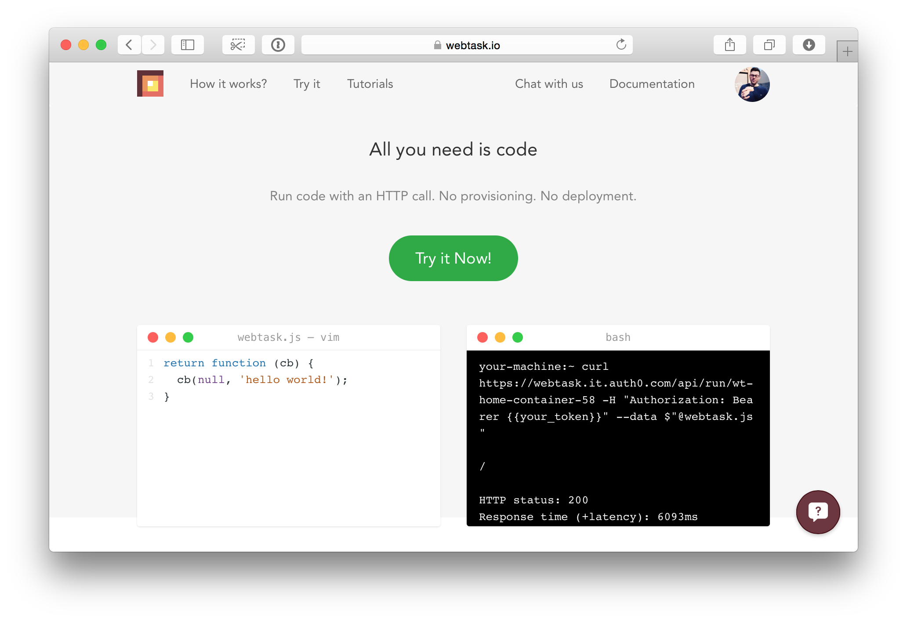
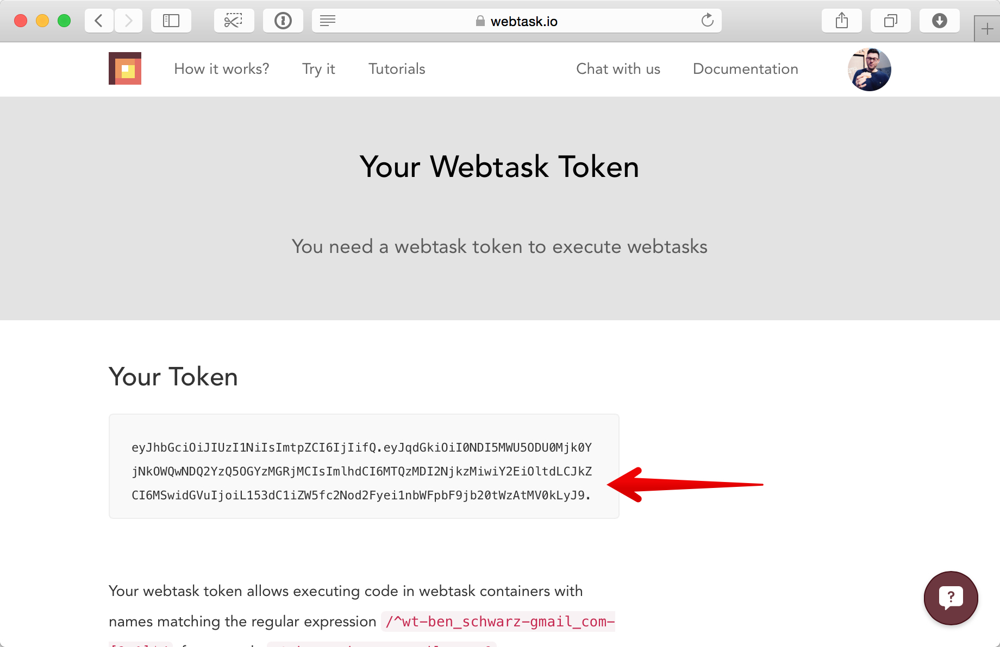
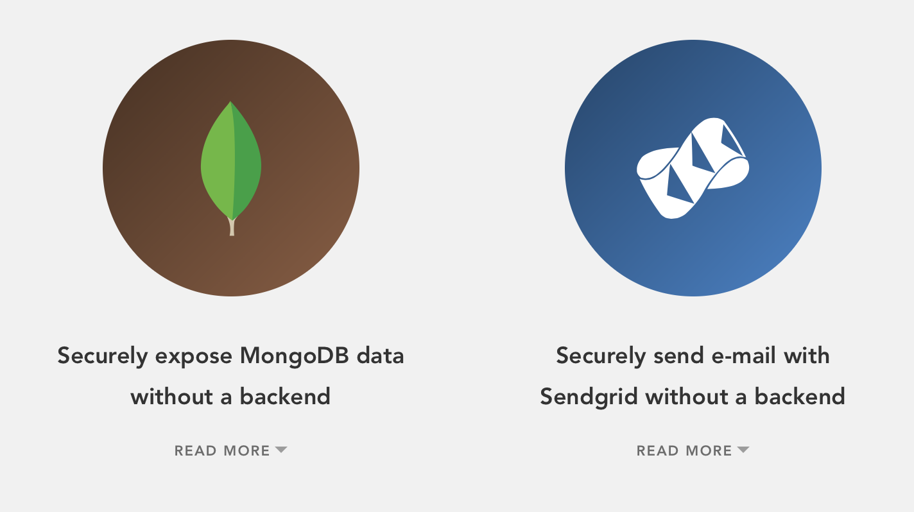

autoscale: true

#[fit] _WEBTASK_
#[fit] __All you need is code__

---


## _@benschwarz_

^ Curator of CSSConfAU

---

## AUTH0
### __Developer advocate__

---


---


^ Instead of building a "simple" interface for technical tasks, we decided to build a technical interface that was easily understandable by our audience

^ What we came up with as the concept of a function that recieves the user in question, the context and callback. Essentially,
we allow our customers to write a middleware layer for our system

---


---


---

```js
function ( user, context, callback ) {
  // magic
}
```

---

# Get additional user data from a database

---

# _Send events to Mixpanel_

^ Track user logins

---

#[fit] Send an SMS via Twilio

^ Notify a user when they've been logged in elsewhere

---



# WEBTASK.IO

---



---

# Request

```bash
curl https://webtask.it.auth0.com/api/run/YOUR_SANDBOX_URL \
  -H "Authorization: Bearer YOUR_TOKEN_HERE" \
  --data-binary 'return function ( context, callback ) {
    callback( null, { message: 'Hello world!' } );
  }'
```

^ Once you have a token, you can then run abstract code against webtask

---

# Response

```json
{ "message": "Hello world!" }
```

---

# Request body

```js
return function( context, callback ) {
  callback( null, { message: "Hello " + context.data.who } );
}
```

^ You may notice that we're returning a hash… webtask is going to rennder this as application json

---

# Called with a queryString

`/run?who=CampJS!`

---

# Response
```json
  { "message": "Hello CampJS!" }
```

---



^ Also, taking payments via stripe

---


## __"When is my next train?"__

---


## __"Give me stats about my npm package"__

---

## __How can I create a webtask that contains secret API keys?__

---

```bash
curl -X POST \
  https://webtask.it.auth0.com/api/tokens/issue \
  -H "Authorization: Bearer YOUR_TOKEN_HERE" \
  -H "Content-Type: application/json" \
  --data-binary '{
    "ectx": {
      "SECRETS": "Stored securely in a jwt token"
    }
  }'
```
^ This will issue a token that you can then run

---

```js
function ( context, callback ) {
  // context.data.SECRETS
}
```

---

Use NPM modules

```js
var Request = require( 'request' );
function ( context, callback ) {
  …
}
```

---

Create a token that will run code from a URL

```bash
curl -X POST \
  https://webtask.it.auth0.com/api/tokens/issue \
  -H "Authorization: Bearer YOUR_TOKEN_HERE" \
  -H "Content-Type: application/json" \
  --data-binary '{
    "url": "https://my-awesome-code.com/magic-secret-sauce.js"
    }
  }'
```

^ Great for sharing

---

## __Play along at home__

---

#[fit] * auth0/webtask-runner*

^ npm install, then send code to the local endpoint

---

### 1. Develop against webtask-runner
### 2. Run it on webtask.io

---

__Running code is as easy as a HTTP request__

---

## _Webtask.io_
## @auth0

^ Give it a shot, and let us know what you do with it

---


## _@benschwarz_

---

## _Thank you_ 

